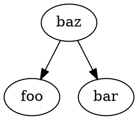
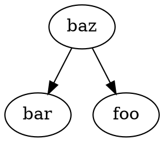
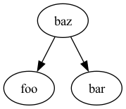

# Job Scheduler

This repository defines a concurrent job scheduler written in Go. The job scheduler reads
a sequence of "jobs" and _executes_ each job concurrently as long as all of the other jobs
it depends on have concluded.

## Usage

### Run

Given a configuration file like the following:

```yaml
jobs:
  - foo
  - bar
  - name: baz
    dependsOn:
      - foo
      - bar
```

The `run` sub-command will print out each of the job's names (separated by newlines) based
on the dependencies between them. Put simply, a job's name will only be written if their
dependencies have all had their names already written.

In the example above, `foo` and `bar` can both be seen as separate entrypoints to the
schedule, and `baz` depends on both `foo` and `bar`.

There are two valid results, shown below:

```
foo
bar
baz
```

```
bar
foo
baz
```

This output means that both the `foo` and `bar` jobs have concluded by the time `baz` is
scheduled.

The `run` sub-command requires an input filepath to a configuration file (like the one shown
above). It can be run with the following:

```bash
./scheduler run ./schedule.yaml
```

### Graph

The `graph` sub-command will produce a directed DOT-graph based on the job configuration.
Using the same configuration specified above, there are two valid results, shown below:





The `graph` sub-command also requires an input job configuration file:

```bash
./scheduler graph ./schedule.yaml
```

You can redirect the output into a `.dot` file like so:

```
./scheduler graph ./schedule.yaml > schedule.dot
```

Generate a PNG of the `.dot` graph using the `./scripts/graph.sh` script. For
example, the following command will create an `example.png` file:

```bash
./scripts/graph.sh example.dot
```

The PNGs for the graph example above is shown below:



For more information on DOT and graphviz, see https://graphviz.org/doc/info/lang.html
